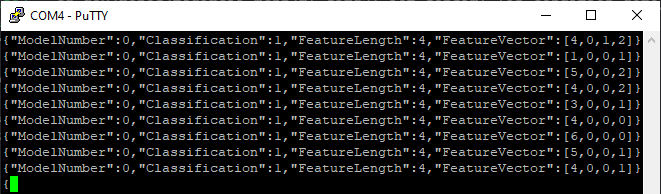
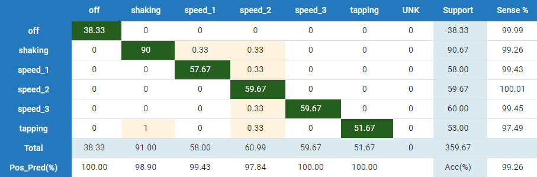

# Fan Condition Monitoring with SensiML
|  |
| :--: |
| Deployed fan condition monitor |

## Repository Overview
This repository is a companion to the [Fan Condition Monitoring with SensiML
tutorial](http://microchip.wikidot.com/machine-learning:fan-condition-monitoring-with-sensiml)
on the Microchip Developer website. It contains the firmware to classify the operational state of a Honeywell HT-900 fan including whether the fan is on, which speed setting it's set at, and whether the fan is experiencing one of two fault conditions (*tapping* or *shaking*). The demo project runs on the [SAMD21 Machine Learning Evaluation Kit](https://www.microchip.com/developmenttools/ProductDetails/EV45Y33A) with the Bosch BMI160 IMU ([Mikroe IMU2 click board](https://www.mikroe.com/6dof-imu-2-click)). The [TDK variant](https://www.microchip.com/DevelopmentTools/ProductDetails/PartNO/EV18H79A) ([Mikroe IMU14 click board](https://www.mikroe.com/6dof-imu-14-click)) of the evaluation kit cannot be used directly with this firmware because the sensor does not natively support the sample rate that was used when developing the fan classifier model.

The fan states that the model can recognize (shown in the video above) are summarized below:

* *Unknown*
* *Fan Off*
* *Tapping*
* *Fon Speed 1*
* *Fon Speed 2*
* *Fon Speed 3*
* *Shaking*

## Hardware Used
* SAMD21 Machine Learning Evaluation Kit with Bosch BMI160 IMU ([EV45Y33A](https://www.microchip.com/developmenttools/ProductDetails/EV45Y33A))

## Software Used
* MPLAB® X IDE (https://microchip.com/mplab/mplab-x-ide)
* MPLAB® XC32 compiler (https://microchip.com/mplab/compilers)
* MPLAB® Harmony 3 (https://www.microchip.com/harmony)
* SensiML Analytics Toolkit (https://sensiml.com/download/)

## Related Documentation
* ATSAMD21G18 [Product Family Page](https://www.microchip.com/wwwproducts/en/ATSAMD21G18)
* SAM-IoT Development Board [Product Details](https://www.microchip.com/developmenttools/ProductDetails/EV75S95A)

# Data Collection
The dataset used for the development of this application consists of 6-axis IMU recordings taken with the [SAMD21 BMI160 evaluation board](https://www.microchip.com/developmenttools/ProductDetails/EV45Y33A) mounted to the housing of a Honeywell HT-900. For further description of the application setup, see the article for this demo on the [Microchip Developer website](http://microchip.wikidot.com/machine-learning:fan-condition-monitoring-with-sensiml).

Head to the [releases page](../../releases) to download the fan condition dataset. Data samples are stored as csv files and can be imported into SensiML's [Data Capture Lab](https://sensiml.com/documentation/data-capture-lab/index.html) en masse using the included DCLI descriptor file. Visit the the SensiML DCLI documentation page [here](https://sensiml.com/documentation/data-capture-lab/importing-external-sensor-data.html#dcli-format-and-pre-labeled-data) for import instructions.

## Data Collection Firmware
A binary build of the data logging firmware used in the data collection for this project can be downloaded from the [releases page](../../releases); to build data logging firmware with different sensor configurations, visit the [ml-samd21-iot-imu-data-logger](https://github.com/MicrochipTech/ml-samd21-iot-imu-data-logger) repository.

## Sensor Configuration
The sensor configuration used in this demo is summarized in the table below.

| IMU Sensor | Axes | Sampling Rate | Accelerometer Range | Gyrometer Range |
| --- | --- | --- | --- | --- |
| [Bosch BMI160](https://www.bosch-sensortec.com/products/motion-sensors/imus/bmi160/) | Ax, Ay, Az, Gx, Gy, Gz | 400Hz (4x oversampling mode) | 2G | 125DPS |

Note that for this project, the firmware (specifically, `bmi160_sensor.c`) was slightly modified to enable oversampling functionality. The change can be summed up in the following diff:

````diff
--- b/firmware/src/app_config/bmi160/bmi160_sensor.c
+++ a/firmware/src/app_config/bmi160/bmi160_sensor.c
@@ -162,7 +162,7 @@ int bmi160_sensor_set_config(struct sensor_device_t *sensor) {
     /* Select the Output data rate, range of accelerometer sensor */
     sensor->device.accel_cfg.odr = _GET_IMU_SAMPLE_RATE_MACRO(ACCEL); //BMI160_ACCEL_ODR_100HZ;
     sensor->device.accel_cfg.range = _GET_IMU_ACCEL_RANGE_MACRO();//BMI160_ACCEL_RANGE_2G;
-    sensor->device.accel_cfg.bw = BMI160_ACCEL_BW_NORMAL_AVG4;
+    sensor->device.accel_cfg.bw = BMI160_ACCEL_BW_OSR4_AVG1; //BMI160_ACCEL_BW_NORMAL_AVG4;

     /* Select the power mode of accelerometer sensor */
     sensor->device.accel_cfg.power = BMI160_ACCEL_NORMAL_MODE;
@@ -170,7 +170,7 @@ int bmi160_sensor_set_config(struct sensor_device_t *sensor) {
     /* Select the Output data rate, range of Gyroscope sensor */
     sensor->device.gyro_cfg.odr = _GET_IMU_SAMPLE_RATE_MACRO(GYRO); //BMI160_GYRO_ODR_100HZ;
     sensor->device.gyro_cfg.range = _GET_IMU_GYRO_RANGE_MACRO(); //BMI160_GYRO_RANGE_2000_DPS;
-    sensor->device.gyro_cfg.bw = BMI160_GYRO_BW_NORMAL_MODE;
+    sensor->device.gyro_cfg.bw = BMI160_GYRO_BW_OSR4_MODE; //BMI160_GYRO_BW_NORMAL_MODE;
````


# Firwmare Operation
The firmware will reflect the state of operation of the demo using the onboard LEDs; this behavior is summarized in the table below.

| State | LED Behavior | Description |
| --- | --- | --- |
| Firmware error | Red LED lit |	Fatal error. (Do you have the correct sensor plugged in?). |
| Data buffer overflow |	Yellow+Red LED lit for 5 seconds | Processing is not able to keep up with real-time; data buffer has been reset. |
| Fan Off | No LED lit | Fan is off. |
| Fan Speed 1 | Blue LED lit | Fan is on at speed setting 1. |
| Fan Speed 2 | Green LED lit | Fan is on at speed setting 2. |
| Fan Speed 3 | Yellow LED lit | Fan is on at speed setting 3. |
| Tapping |	Yellow LED flashing	| Detected tapping on the fan housing.  |
| Shaking | Red LED flashing | Detected mount shaking. |
| Unknown | Red+Yellow LED flashing | Detected anomalous behavior. |

In addition, the firmware also prints the classification output for each inference over the UART port. To read the UART port output, use a terminal emulator of your choice (e.g., PuTTY) with the following settings:

- Baudrate 115200
- Data bits 8
- Stop bits 1
- Parity None

A sample of the terminal output is shown in the figure below.

|  |
| :--: |
| UART Terminal Output |

Note that the output classification is given as an integer number which is the class ID; the class ID to class label mapping is described in the table below.

| Class ID | Class Name |
| --- | --- |
| 0 | *Unknown* |
| 1 | *Fan Off* |
| 2 | *Tapping* |
| 3 | *Fon Speed 1* |
| 4 | *Fon Speed 2* |
| 5 | *Fon Speed 3* |
| 6 | *Shaking* |

## Usage with SensiML Open Gateway
The firmware UART output can be visualized with the SensiML [Open Gateway application](https://github.com/sensiml/open-gateway):

1. Open a terminal and change to the directory where you've checked out this repository.
2. Clone the open-gateway repository and install the dependencies:
    > `git clone https://github.com/sensiml/open-gateway`\
    > `pip install -r open-gateway/requirements.txt`
3. Change the baudrate (`BAUD_RATE` variable) in `open-gateway/config.py` to 115200
4. Change to the open-gateway directory and run the open-gateway application, passing in the fan demo's model.json description file:
   > `cd open-gateway`\
   > `python app.py -m firmware/knowledgepack/libsensiml/model.json`
5. Connect to the SAMD21 board in the gateway application:
   * Select the `Recognition` device mode.
   * Select `Serial` connection type, and enter the UART address (e.g. COM4) in the `Device ID` field.
   * Click `Connect To Device`.
6. Switch to the `Test Mode` tab and click `Start Stream`.

## Firmware Benchmark
Measured with the BMI160 sensor configuration, ``-O2`` level compiler optimizations, and 48MHz clock
- 63.2kB Flash
- 5.8kB RAM
- 12ms Inference time

## Classifier Performance
Below is the confusion matrix result for the classifier evaluated on the entire ht-900 fan condition dataset.

